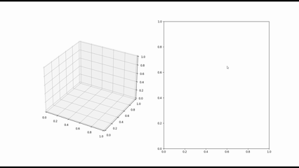
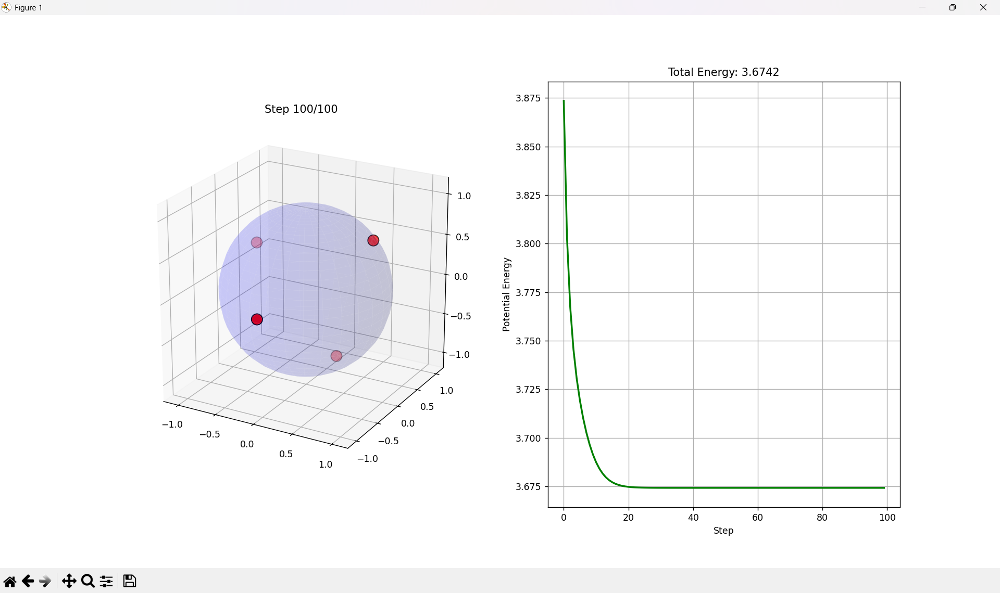
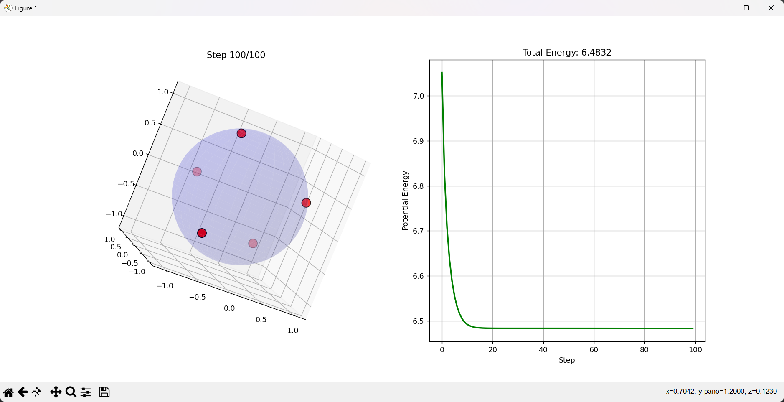
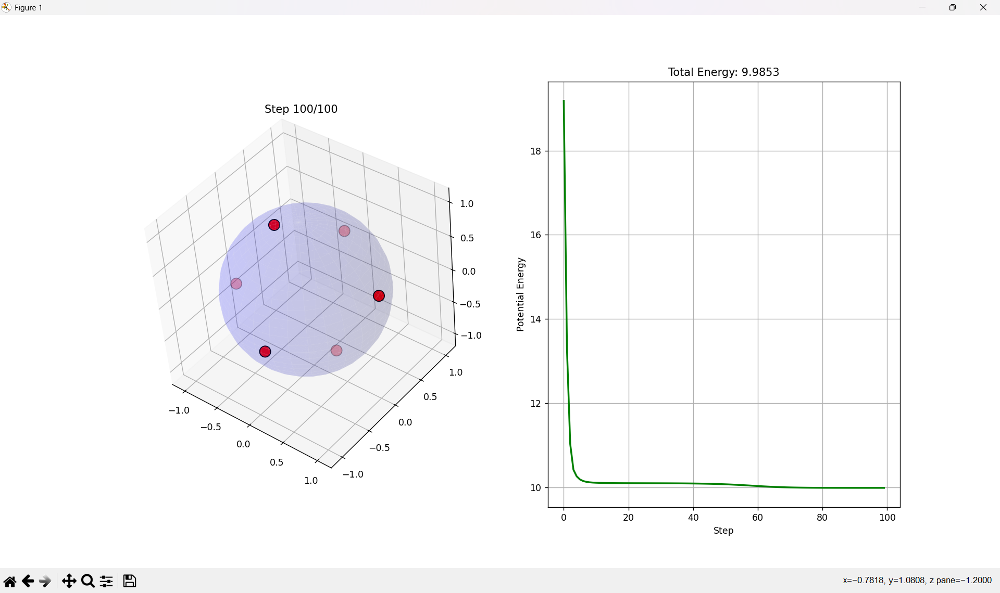
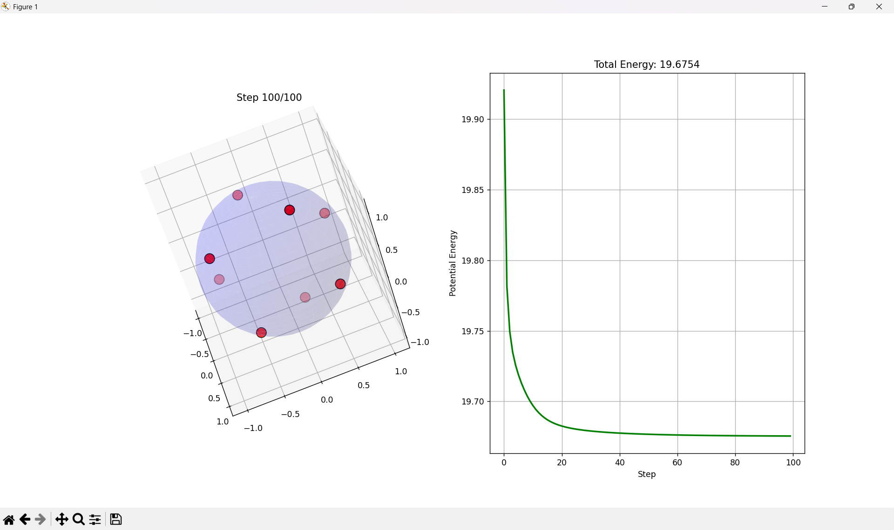

# Thomson-Problem-Optimizer

A personal project with a simulation of the classic Thomson Problem, where it generates a random configuration of point charges on a sphere which settle into a stable configuration over time.



## Mathematical Approach

### 1. The Objective Function
The goal is to minimize the non-convex electrostatic potential energy $U$ of the system. For $N$ charges, the energy is defined as:

$$
U = \sum_{i=1}^{N-1} \sum_{j=i+1}^{N} \frac{1}{|\mathbf{r}_i - \mathbf{r}_j|}
$$

### 2. Force Calculation
At each discrete time step, the simulation calculates the net Coulomb repulsion vector $\mathbf{F}_i$ acting on each point. This requires an $\mathcal{O}(N^2)$ operation computing interactions across all point pairs:

$$
\mathbf{F}_i = \sum_{j \neq i} \frac{\mathbf{r}_i - \mathbf{r}_j}{|\mathbf{r}_i - \mathbf{r}_j|^3}
$$

### 3. Tangent Plane Projection
To update the coordinates without the points drifting off the sphere, the algorithm utilizes vector rejection to isolate the tangential force. Given that the position vector $\mathbf{r}_i$ serves as the normal vector to the sphere at that point, the perpendicular force is isolated via:

$$
\mathbf{F}_{perp} = \mathbf{F}_i - (\mathbf{F}_i \cdot \mathbf{r}_i)\mathbf{r}_i
$$

Points are displaced along this tangent using a dynamic learning rate scaled by the point count ($\alpha=1/N$), followed by Euclidean normalization ($\mathbf{r}/||\mathbf{r}||$) to strictly enforce the radius boundary.

## Emergent Symmetries (Results)
By modifying the $N$ parameter, the algorithm successfully breaks symmetry and converges on known Platonic solids and optimal geometric configurations:

<table align="center">
  <tr>
    <td align="center">
      <br>
      <b>N = 4 (Tetrahedron)</b>
    </td>
    <td align="center">
      <br>
      <b>N = 5 (Triangular Bipyramid)</b>
    </td>
  </tr>
  <tr>
    <td align="center">
      <br>
      <b>N = 6 (Octahedron)</b>
    </td>
    <td align="center">
      <br>
      <b>N = 8 (Square Antiprism)</b>
    </td>
  </tr>
</table>

## Requirements & Usage
Built entirely with standard data science libraries for highly readable, vectorized execution.

```bash
pip install numpy matplotlib
python main.py
